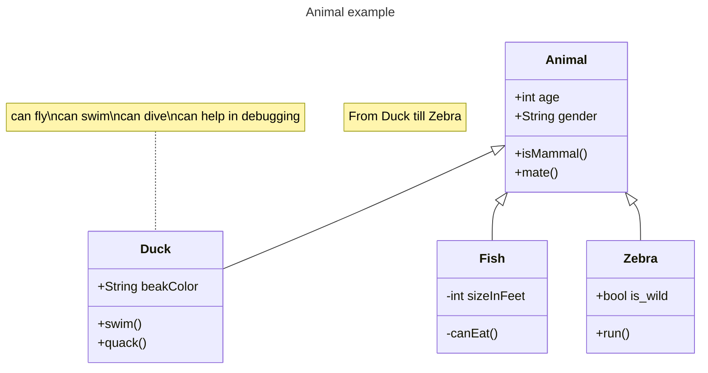

# TowerDefenseTemplate
omschrijving:
basic tower defense maar met meerdere path opties (5 of meer). in game heb je idle currency generation die je nodig hebt voor upgrades, en je krijgt een andere currency voor enemies doden die je gebruikt om towers te kopen. towers hebben abilities die of al vanaf het begin er zijn of verschillen per path. je kan de currency van enemies doden omzetten in idle currency.

## Product 1: "DRY SRP Scripts op GitHub"

Plaats hier minimaal 1 link naar scripts die voldoen aan de eisen van **"Don't Repeat Yourself (DRY)"** en **"Single Responsibility Principle"**.
Omschrijf hier waarom jij denkt dat je in die scripts aan deze eisen voldoet.

Bijvoorbeeld:

*https://github.com/strddustt/TowerDefense/blob/master/Unity/Assets/scipts/attacking%20and%20related/projectilequeue.cs* ik instantiate alle projectiles via een loop, en dit script gaat alleen over het behouden van de queue met projectiles

## Product 2: "Projectmappen op GitHub"

Je commit de mappenstructuur van je unity project op github en verwijst vanuit je readme naar de root map van je project. Met een netjes en goed gestructureerde mappenstructuur en benamingen van files toon je aan dat je dit leerdoel beheerst. 

https://github.com/strddustt/TowerDefense

## Product 8: Prototype test video
Je hebt een werkend prototype gemaakt om een idee te testen. Omschrijf if je readme wat het idee van de mechanics is geweest wat je wilde testen en laat een korte video van de gameplay test zien. 

## Product 9: SCRUM planning inschatting 

Je maakt een SCRUM planning en geeft daarbij een inschatting aan elke userstory d.m.v storypoints / zelf te bepalen eenheden. (bijv. Storypoints, Sizes of tijd) aan het begin van een nieuwe sprint update je deze inschatting per userstory. 

Plaats in de readme een link naar je trello en **zorg ervoor dat je deze openbaar maakt**

[Link naar de openbare trello](https://trello.com/b/w60wkKSU/examen-paraphrenia)

## Product 10: Gitflow conventions

Je hebt voor je eigen project in je readme gitflow conventies opgesteld en je hier ook aantoonbaar aan gehouden. 

De gitflow conventions gaan uit van een extra branch Develop naast de "Master"/"Main". Op de main worden alleen stabiele releases gezet.

Verder worden features op een daarvoor bedoelde feature banch ontwikkeld. Ook kun je gebruik maken van een hotfix brancg vanaf develop.

Leg hier uit welke branches jij gaat gebruiken en wat voor namen je hier aan gaat meegeven. Hoe vaak ga je comitten en wat voor commit messages wil je geven?

Meer info over het gebruiken van gitflow [hier](https://www.atlassian.com/git/tutorials/comparing-workflows/gitflow-workflow)

